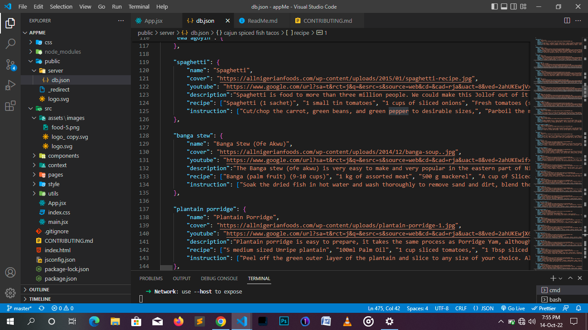

# Welocme to bChef

An open, crowd-sourced database of recipes from around the world. We have over 200 recipes available from different continents.   

# :movie_camera: Project Overview
You can check out the live project [here](https://bchef.netlify.app/)  

All you need to do is start by entering the kitchen, then enter a meal in the search bar, and the recipe will be provided. Below the image, description and link to youtube video.

# :mega: Want to contribute?
We would love to have you! bChef is open source and we are keen on hearing what you have for us. Do check out the [code of conduct](https://github.com/codeboyfriend/bChef/blob/master/CODE_OF_CONDUCT.md) for rules and guidelines, and our [CONTRIBUTING.md file](https://github.com/codeboyfriend/bChef/blob/master/CONTRIBUTING.md) for any steps you might need.

## :bulb: Getting Started
Found a bug? Accessessibility issue?, New feature? Or do you want to add a recipe to our database? Then go right ahead and create an issue.

### Tech Stack
This project uses:
- [React](https://reactjs.org/)
- [TailwindCSS](https://tailwindcss.com)
- [SCSS](https://sass-lang.com)

### Prerequisites
Before installation, you need to have the following: 
- [Node](https://nodejs.org) installed
- Basic knowledge of [Git](https://git-scm.com/)
- Basic knowledge of [Github](https://github.com/)

### Steps
1. [Fork](https://github.com/codeboyfriend/bChef/fork) this repository. 
2. In your terminal, clone your fork repository using `git clone <link to your fork>`.
3. Run `cd bChef` to navigate to project directory.
4. Run `npm install` to add node_modules folder.
5. To start the server on localhost, run `npm run dev`.
>This project uses [Vite](https://vitejs.dev), but that shouldn't overwhelm you. Everything works pretty much the same with [React app](https://reactjs.org).

6. Make your changes, push your code, and open a pull request

### Adding a recipe
Before adding a recipe, please make sure that the new recipe does not already exist. You can easily check this by entering the recipe on the [live](https://bchef.netlify.app/) site to see if its gives a result or not. Or checking the [database](https://github.com/codeboyfriend/bChef/blob/master/public/server/db.json) to see if its already exist.

>We use [JSON](https://www.w3schools.com/js/js_json_intro.asp) to store the abbreviations.

1. In the `/public` folder, open the `/server` folder and subsequently, the `db.json` file you find in it. You can see that each meal is a JSON object of its own with a `name`, `cover`, `description`, `youtube`, `recipe` and `instruction`.

2. To add a new recipe, you must append a new object to this file. 
    - The meal which is the key  must be in lowercase. For example, `noodles` not `Noodles` or `NOODLES`
    - The name must be in sentence case. For example, `Gbegiri soup`
    - Cover must be a link to the image of the meal.
    - Description should contain a short note about the meal. It must not be too lengthy.
    - Youtube must contain verified link to a youtube video on how to prepare the meal.
    - Recipe must be an array of the ingredients needed for preparing the meal.
    - Instruction must be an array of steps to follow when preparing the meal.

3. The Screenshot below could help
   

:bomb: Now, GO CREATE THOSE ISSUES AND PULL REQUESTS!

# :key: License
This project is licensed with [MIT](https://www.apache.org/licenses/LICENSE-2.0).

If you like the [project](https://bchef.netlify.app/), Don't forget to leave a star :star: . All support is highly appreciated :100:    
    
